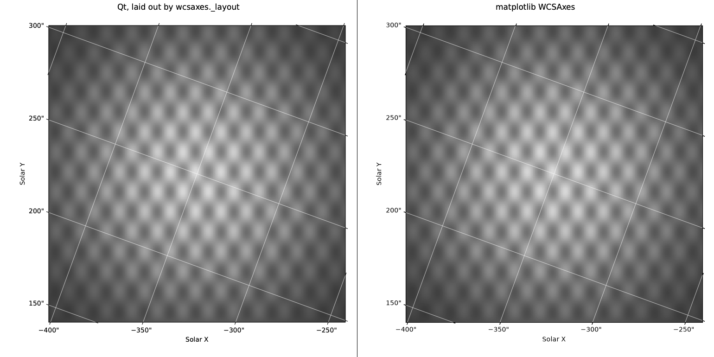
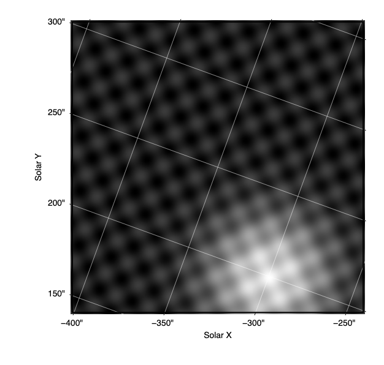

# WCSAxes layout core demos

These are standalone demos for the astropy branch `wcsaxes-layout-core`. That branch moves the tick, grid and label geometry of WCSAxes into `astropy/visualization/wcsaxes/_layout.py`, a private module that does not import matplotlib, and leaves every WCSAxes figure pixel-identical. Each demo here draws the same ticks with a different toolkit, and `check_move.py` checks that the branch moved the code unchanged. None of this is part of astropy.

## Checking the move: `check_move.py`

Almost every moved line renames an attribute of `self`: `self.coord_index` becomes `spec.coord_index`, `transData.transform` becomes `to_display`, and so on. So `git diff --color-moved` marks only part of the move. `check_move.py` takes each moved function or block at the branch's base commit, applies those renames, and compares it with the new function in `_layout.py`. Docstrings, comments and line wrapping are ignored, and comments are compared on their own.

```
python check_move.py /path/to/astropy-wcsaxes-core
```

For each of the 17 pieces it lists the renames and prints what differs beyond them. That is mostly lines that stayed in the matplotlib classes, such as `if self.coord_index is None: return` or the `Ticks.add` calls, and the few lines that change, such as the 1-D frame taking its number of samples from the sampled spine. On the branch, counting lines as `ast.unparse` writes them, 251 old lines are the same after the renames, 69 did not move or were replaced, and 25 new lines replace them.

## Qt: `qt/`



### Running it

You need astropy installed from the branch, plus PyQt5 and matplotlib.

```
cd qt
python wcs_qt.py hpc       # or car, tan; drag to pan, scroll to zoom
python compare.py          # writes output/*.png and prints the table below
```

Without a display, set `QT_QPA_PLATFORM=offscreen`. `python wcs_qt.py tan --png tan.png` renders one case without opening a window. `compare.py` exits with status 1 if Qt and matplotlib disagree by more than the limits below.

### What it shows

`wcs_qt.py` is a plain `QWidget` that uses `QPainter` to draw an image with WCSAxes-style ticks, tick labels, grid lines and axis labels. Every `paintEvent` lays everything out again, so panning, zooming and resizing just repaint. Sizes are matplotlib's defaults at 100 dpi: 10 pt text is 13.9 px and ticks are 3.5 pt. The three cases are built in code:

- `hpc`: an IRIS-like slit-jaw image, helioprojective in arcsec and rolled by 20°, so the ticks on both labelled spines are rotated.
- `car`: an all-sky plate carrée whose galactic longitude wraps from 360° to 0° in the middle.
- `tan`: a plain RA/Dec TAN image, with RA labelled in hours.

`compare.py` renders each case in two views:

- **initial:** the view the widget opens with.
- **moved:** after a drag, two wheel notches and a resize, all sent through the widget's own event handlers.

For each view it also draws matplotlib's WCSAxes with the same canvas size, frame box, limits and dpi. It writes the two side by side to `qt/output/<case>_<view>.png`, Qt on the left and matplotlib on the right, and compares what each one drew:

| case | view | ticks | tick position (px) | tick angle (°) | labels drawn | label position (px) | limit (px) |
|---|---|---|---|---|---|---|---|
| hpc | initial | 20 | 2.8e-14 | 7.0e-12 | 10 | 0.16 | 1.0 |
| hpc | moved | 10 | 2.3e-13 | 6.3e-12 | 7 | 0.16 | 1.0 |
| car | initial | 24 | 1.1e-13 | 1.5e-12 | 14 | 0.47 | 1.0 |
| car | moved | 18 | 2.3e-13 | 4.5e-12 | 11 | 0.47 | 1.0 |
| tan | initial | 20 | 1.1e-13 | 0 | 12 | 3.45 | 4.0 |
| tan | moved | 18 | 2.3e-13 | 0 | 11 | 3.45 | 4.0 |

"ticks" and "labels drawn" are counts: the major ticks of both coordinates on all four spines, and the tick and axis labels drawn. The position and angle columns are the largest differences from matplotlib.

- **Identical on both sides:** the world value of every tick, every label string after simplification (`17ʰ46ᵐ00ˢ`, then `45ᵐ48ˢ`, `36ˢ`), the sequence of labels drawn, and every grid line, vertices and path codes alike.
- **Tick positions and angles** differ only by the rounding of the two display transforms. The limit is 1e-6.
- **Label positions** depend on text size, and Qt and Agg measure text slightly differently even in the same font. `compare.py` loads matplotlib's DejaVu Sans into Qt.
  - In `hpc` and `car`, the tick labels and the axis labels placed beyond them agree to within 0.5 px.
  - In `tan`, matplotlib draws the hour superscripts as mathtext, which is taller. The RA labels are 0.7 to 1.7 px apart, and the RA axis label 3.4 px.
- **Overlap rule:** no labels overlapped in these six views. `keep_tick_labels` ran, but it dropped nothing on either side.

The other renders are [hpc moved](qt/output/hpc_moved.png), [car](qt/output/car_initial.png), [car moved](qt/output/car_moved.png), [tan](qt/output/tan_initial.png) and [tan moved](qt/output/tan_moved.png).

### Why QPainter rather than pyqtgraph

Everything `_layout` returns is in display pixels with the origin at the bottom left, and QPainter draws in device pixels. The only conversions are flipping y and the sign of the rotation. pyqtgraph would give pan and zoom for free. It would also bring its own axis items, and a scene-to-view transform between the core's display pixels and the text measurement. QPainter needs nothing beyond PyQt5, and pan and zoom take about 15 lines.

### What the core gave it

The demo works out no geometry itself beyond a rectangle and an affine display transform. It gets the rest from `_layout`, and from `coordinate_range.find_coordinate_range`, which is unchanged:

- **`place_ticks`:** where each coordinate's ticks cross each spine, which way they point, and the formatter's labels. That includes longitude wrapping, rolled frames, and spines that leave the sky (pan the CAR case past a pole).
- **`grid_lines`:** sampled grid lines, with path codes that break a line where it jumps or has no pixel position. The demo splits each line at those codes and draws polylines.
- **`tick_labels`, `sort_labels` and `simplify_labels`:** the labels held as `TickLabels` holds them, and the label shortening that WCSAxes does (`−28°50'`, `52'`, `54'` and so on).
- **`anchor_tick_labels` and `keep_tick_labels`:** label centres, worked out from a `measure(text)` callback, and which labels to draw.
- **`spine_midpoint` and `axis_label_position`:** where each axis label goes and how it is rotated.

The demo never creates a Figure, an Axes, a transform or a renderer. At exit it asserts that no `matplotlib.pyplot`, `matplotlib.figure` or `matplotlib.backends.backend_*` module was imported.

### What was still awkward

- **Label text is mathtext.** For hours, the angle formatter writes `17$\mathregular{^h}$46$\mathregular{^m}$...`.
  - The demo maps the three separators to Unicode superscript letters before it measures and draws them. That works, but it is a string replacement on a format, and the result does not look like matplotlib's (see the `tan` rows).
  - A text mode for the formatter, `'unicode'` or `'ascii'`, would remove the need. `Angle.to_string` already has a unicode format.
  - Default axis labels that carry a unit have the same problem (`{unit:latex}`). The demo sets its own labels.
- **matplotlib is still imported.**
  - `formatter_locator` reads `rcParams` and calls `Formatter.fix_minus`.
  - When matplotlib is installed, importing anything from `astropy.visualization.wcsaxes` also imports its matplotlib-based public API.
  - So the demo does not draw with matplotlib, but it cannot run without matplotlib installed.
- **The coordinate metadata is written by hand.** The type, wrap and format unit of each coordinate come from `wcsapi.transform_coord_meta_from_wcs`. That function needs a matplotlib frame class and builds a matplotlib `Transform`, so the demo writes them in each case. `compare.py` checks that they match what WCSAxes derives.
- **The orchestration is not in the core.** About 25 of the 90 lines of `layout()` redo what `CoordinateHelper`, `core.py` and `AxisLabels` do around the core:
  - pass each coordinate's kept label boxes on to the next coordinate;
  - take the union of all those boxes for the axis labels;
  - apply the 'labels' visibility rule.

  `_layout.tick_labels(placed)` fills the store shaped like `TickLabels`, where `angle` is the spine normal and `tick_angle` is the tick direction. An axis-label step that takes all the kept boxes would cover most of the rest.
- **Text measurement has a convention.** To match matplotlib, `measure` must return the advance width, and a height of one em unless the ink is taller.
  - matplotlib 3.11 sizes a line of text from the font's typographic ascender and descender, which add up to one em in DejaVu Sans. Qt 5 does not expose them.
  - With Qt's own line height (ascent plus descent: 16.3 px against 13.9 px), the labels moved by up to 2.4 px.
  - The docstring of `anchor_tick_labels` now says so.
- **There are two boundary styles.** `_layout` takes plain callables, but `find_coordinate_range` wants an object with a `.transform` method.
- **Spine choice is up to the caller.** WCSAxes' automatic placement of tick labels and axis labels (`_auto`) is not in the core. The demo puts the longitude labels on the bottom spine and the latitude labels on the left, and `compare.py` sets the same positions on WCSAxes. Minor ticks would work the same way as major ticks, but they are not wired up.

## bqplot: `bqplot/`



This is the Jupyter side of two open requests: [making WCSAxes usable by other plotting libraries](https://github.com/astropy/astropy/issues/9993), and [world coordinates in glue-jupyter's bqplot image viewer](https://github.com/glue-viz/glue-jupyter/issues/154), whose axes show pixel indices today.

### Running it

You need astropy installed from the branch, plus bqplot, ipywidgets and Pillow. `compare.py` also draws with matplotlib.

```
cd bqplot
python wcs_bqplot.py      # writes html/<case>.html for hpc, car and tan
python compare.py         # prints the table below; exits with 1 on a mismatch
jupyter lab demo.ipynb    # live figures: drag to pan, scroll to zoom
```

- The pages in `html/` are static snapshots, written with `ipywidgets.embed.embed_minimal_html`. They load the widget JavaScript from jsdelivr, so they need a network connection. A static page has no kernel to rerun the layout, so pan and zoom are off in these pages.
- `screenshots/` holds those pages as rendered by headless Chrome 154: [hpc](bqplot/screenshots/hpc.png), [car](bqplot/screenshots/car.png) and [tan](bqplot/screenshots/tan.png).
- The notebook has not been run in a live Jupyter session, because the environment had no Jupyter server. Its cells were run as plain Python, and `compare.py` moves the scales from Python, as PanZoom does.

### What it shows

`figure(name)` returns a bqplot `Figure` with no bqplot axes:

- An `Image` mark sits in two `LinearScale`s over data pixels, which PanZoom moves.
- The frame, ticks and grid are `Lines` marks, and the tick labels and axis labels are `Label` marks. They use a second pair of scales spanning the plot area in display pixels, with the origin at the bottom left and y up. That is the core's own display space, so the only conversion is the sign of the axis-label rotation.
- The grid is clipped to the plot area, which is the frame. Ticks and labels are not clipped.
- The figure observes `min` and `max` of the two image scales. Each change reruns `layout()` and replaces the marks' data. One scale change sends two notifications, and the second one is skipped.
- The image is computed from world coordinates, with a blob placed on a grid crossing: −300″/200″, 90°/30° and 24ˢ/56′. In the screenshots, the blobs sit on those crossings, which shows that the image and the grid agree.
- The three cases use the same WCSs as the Qt demo.

### Compared with WCSAxes

`compare.py` checks each case in two views:

- the whole image;
- a zoomed and panned view, set through the figure's bqplot scales as PanZoom sets them. This also checks the relayout path. The CAR view runs off the sky past the edge of the image, and crosses longitude 0, where the labels go from 0° to 315°.

For each view, it draws WCSAxes on Agg over the same display pixels, with the same limits, dpi, label spines and axis labels:

```
case view   coord  ticks  world    pixel    angle  texts   grid  drawn  anchor    box axis label
hpc  full       0  10/10   True  0.0e+00  0.0e+00   True   True    4/4    0.00   0.00       0.00
hpc  full       1  10/10   True  0.0e+00  0.0e+00   True   True    4/4    0.00   0.00       0.00
hpc  zoomed     0  10/10   True  0.0e+00  0.0e+00   True   True    4/4    0.00   0.00       0.00
hpc  zoomed     1  10/10   True  0.0e+00  0.0e+00   True   True    3/3    0.00   0.00       0.00
car  full       0  10/10   True  0.0e+00  0.0e+00   True   True    5/5    0.00   0.00       0.00
car  full       1  14/14   True  0.0e+00  0.0e+00   True   True    7/7    0.00   0.00       0.00
car  zoomed     0  10/10   True  0.0e+00  4.0e-12   True   True    5/5    0.00   0.00       0.00
car  zoomed     1    4/4   True  0.0e+00  1.3e-12   True   True    0/0    0.00   0.00       none
tan  full       0  10/10   True  0.0e+00  0.0e+00   True   True    5/5    1.72   3.45       3.45
tan  full       1  10/10   True  0.0e+00  0.0e+00   True   True    5/5    0.00   0.00       0.00
tan  zoomed     0  10/10   True  0.0e+00  0.0e+00   True   True    5/5    1.72   3.45       3.45
tan  zoomed     1    6/6   True  0.0e+00  0.0e+00   True   True    3/3    0.00   0.00       0.00
```

"ticks" and "drawn" are counts, as demo/WCSAxes. The other numbers are the largest differences, in display pixels or degrees.

- **Exact:** the tick world values, every label text on every spine after sorting and simplifying, every grid line (vertices and path codes), and the numbers of ticks and of drawn labels.
- **Tick positions and angles:** positions are identical, and angles agree to 4e-12°.
- **Label anchors, label boxes and axis labels:** these agree to 0.00 px for plain text.
  - For the RA labels of `tan`, the differences are 1.7, 3.5 and 3.5 px, because matplotlib draws the hour superscripts as mathtext, which is taller.
- **Zoomed CAR:** the left spine is off the sky, so neither side draws latitude labels or a latitude axis label.
- **Failure check:** a wrong wrap, minus sign or format unit, set on purpose, makes the script exit with 1.

### How `measure()` is approximated

The core calls `measure(text, x, y)` for each label's width and height. The text is drawn in the browser, and the kernel cannot ask the browser for a size and wait for the answer. So the demo measures in the kernel:

- **Width:** Pillow's advance width of the label in DejaVu Sans at 13.9 px. DejaVu Sans is the font that matplotlib ships.
- **Height:** the font size.

For plain text, these are matplotlib's numbers to the pixel, which is why the table shows 0.00. The browser then draws the labels in its own sans-serif, so a drawn label can be slightly wider or narrower than the box that the core placed. Labels are centred on their anchors, so on the left spine the gap between a label and its tick changes by half that difference.

An exact answer needs a round trip through the front end: measure there, send the sizes back, and lay out again. bqplot has no API for this.

### What the core gave it

It uses the same functions as the Qt demo: `place_ticks`, `grid_lines`, `tick_labels`, `sort_labels`, `simplify_labels`, `anchor_tick_labels`, `keep_tick_labels`, `spine_midpoint` and `axis_label_position`, plus `find_coordinate_range`. The demo's own geometry is a rectangle and an affine transform. The path codes from `grid_lines` map directly onto bqplot: a NaN row before each `MOVETO` breaks a `Lines` mark at that point.

### What was still awkward

The points listed for Qt apply here too: mathtext labels, matplotlib still being imported, coordinate metadata written by hand, orchestration around the core, and spine choice. The orchestration is about 21 of the 69 lines of `layout()`. Specific to bqplot:

- **Text cannot be measured where it is drawn.** See the section above.
- **Mathtext.** bqplot's `Label` mark draws plain SVG text, so `$\mathregular{^h}$` has to become `ʰ` before it is measured and drawn, as in Qt.
- **Static pages cannot lay out again.** In the exported HTML, pan and zoom would move the image under fixed ticks. A page without a kernel would need the core running in the browser, for example through Pyodide.
- **One rotation per `Label` mark.** `rotate_angle` applies to every label in a mark; rotating labels individually needs a rotation scale. So each axis label is its own mark. Tick labels are not rotated, so one mark per coordinate is enough.
- **A WCS built in code changes its units.** For `HPLN-TAN` with `cunit = "arcsec"`, `world_axis_units` reports arcsec until wcslib's `set()` runs, and degrees after it. `pixel_to_world_values` returns degrees in both cases. The demo calls `wcs.wcs.set()` when it builds a case.
